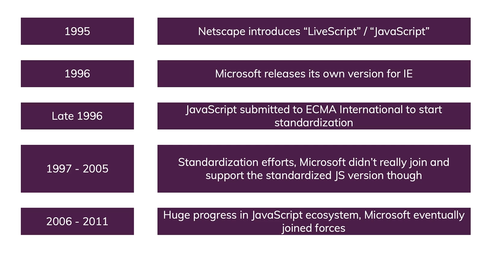

# Early Years of Javascript

### Creation at *Netscape*

In the <b>90's</b> web pages could only be static, lacking the capability for dynamic behavior after the page was loaded in the browser.

In 1995, Netscape decided to add a scripting language to *Navigator*.

> <b>*Navigator*</b> is a web browser that made by *Netscape*

### Adoption by *Microsoft*

Microsoft debuted *Internet Explorer* in 1995, leading to a browser war with Netscape.
On the JavaScript front, Microsoft reverse-engineered the *Navigator* interpreter to create its own, called <b>*JScript*</b>.

### The rise of JScript

In November 1996, Netscape submitted JavaScript to <b>*Ecma International*</b>, as the starting point for a standard specification that all browser vendors could conform to.

> <b>*Ecma International*</b> is a nonprofit standards organization for standardization of information and communication technology and consumer electronics

 

    

