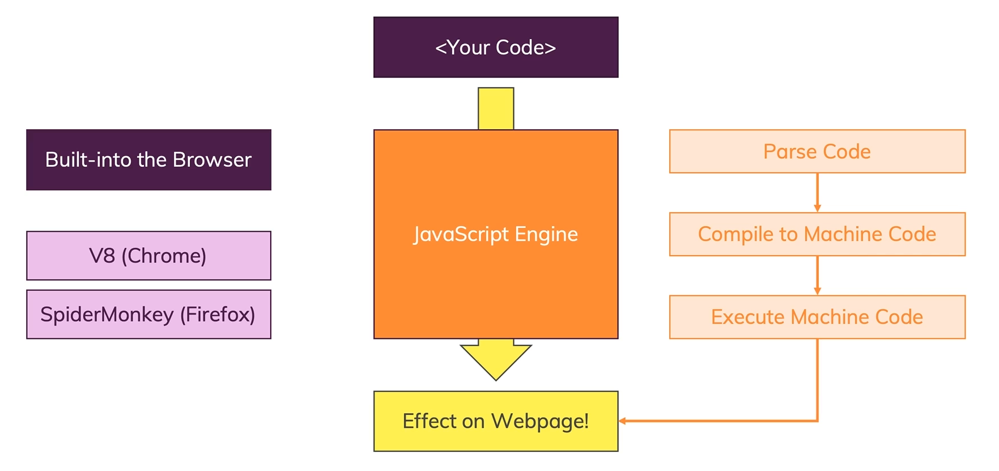

# How Javascript Run ?

- JavaScript code is executed in the context of a web browser or a JavaScript runtime environment.

- When a user visits a web page that contains JavaScript code, the web browser's <b>*[JavaScript engine](#javascript-engine)*</b> reads, interprets, and executes the code.

This process typically involves several stages:

- <b>Parsing</b>: The JavaScript engine breaks down the code into individual tokens, identifying keywords, variables, functions, and other language constructs.

- <b>Compilation</b>: The engine translates the tokens into machine code, which can be executed directly by the computer's processor. This process may involve several stages, such as *[just-in-time](#jit-just-in-time-compilation)* (JIT) compilation, where the engine dynamically compiles frequently executed code for better performance.

- <b>Execution</b>: The engine executes the machine code, performing the actions specified by the JavaScript code, such as manipulating the Document Object Model (DOM), handling user input, and making network requests.

 

    

