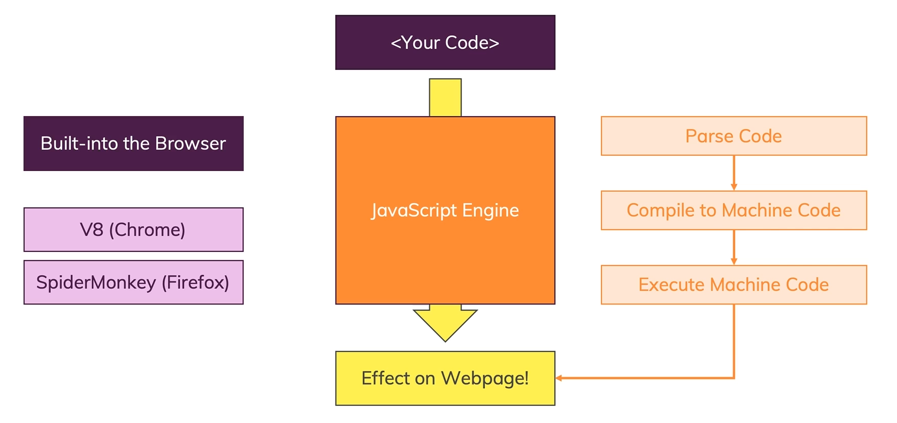
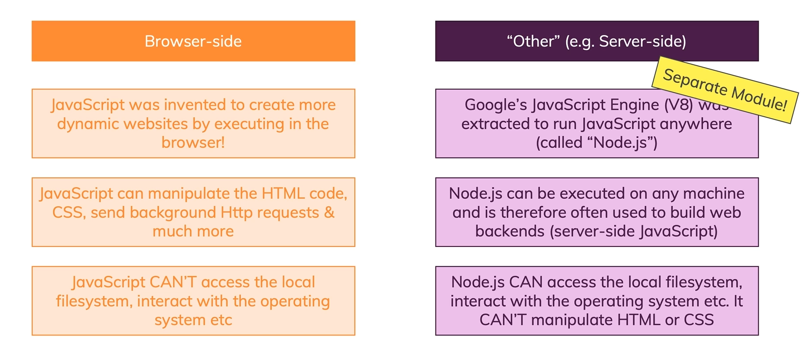
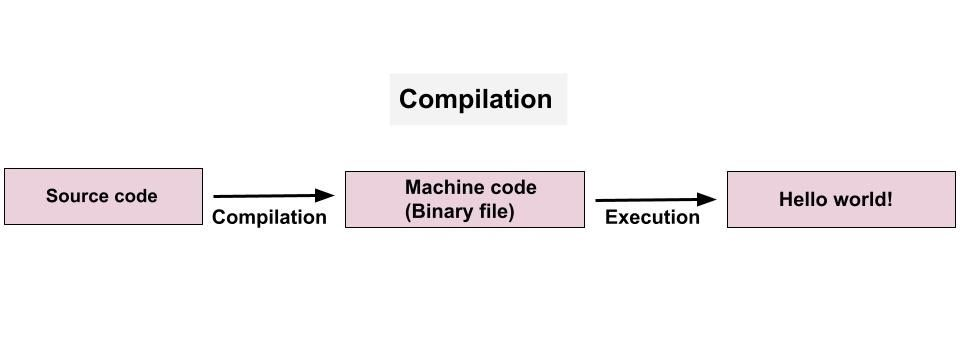
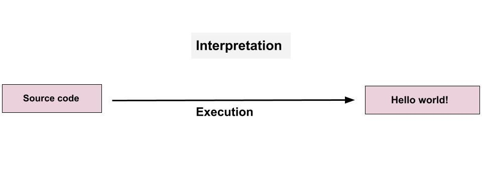
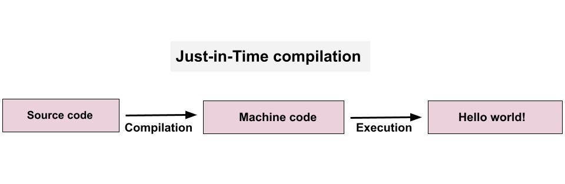

# How Javascript Run ?

- JavaScript code is executed in <b>*[JavaScript runtime environment](#javascript-runtime-environment)*</b>.

- When a user visits a web page that contains JavaScript code, the web browser's <b>*[JavaScript engine](#javascript-engine)*</b> reads, interprets, and executes the code.

This process typically involves several stages:

- <b>Parsing</b>: The JavaScript engine breaks down the code into individual tokens, identifying keywords, variables, functions, and other language constructs.

- <b>Compilation</b>: The engine translates the tokens into machine code, which can be executed directly by the computer's processor. This process may involve several stages, such as *[just-in-time](#jit-just-in-time-compilation)* (JIT) compilation, where the engine dynamically compiles frequently executed code for better performance.

- <b>Execution</b>: The engine executes the machine code, performing the actions specified by the JavaScript code, such as manipulating the Document Object Model (DOM), handling user input, and making network requests.

<br>

<p align="center">
    
</p>

## JavaScript Runtime Environment

A runtime environment is where your program will be executed. It determines what global objects your program can access and it can also impact how it runs.


### A Browser’s Runtime Environment

- JavaScript code could only be executed <b>in a browser</b> and was used exclusively for creating *front-end applications*.

### The Node Runtime Environment

- The Node runtime environment was created for the purpose of executing JavaScript code <b>without a browser</b>.
- Node is an entirely different runtime environment, meaning that browser-environment data values and functions can’t be used.


<p align="center">
    
</p>


## Javascript Engine

A JavaScript engine is a software component that <b>interprets and executes</b> JavaScript code.
<br>
List of JavaScript Engines:

|Browser|Name of Javascript Engine|
|:-:|:-:|
|Google Chrome|V8|
|Mozilla Firefox|Spider Monkey|
|Edge (Internet Explorer)|Chakra|
|Safari|Javascript Core Webkit|

## JIT (Just In Time) Compilation

The process that involves the translation of JavaScript code into machine code occurs using compilation and interpretation.


### Compilation

In compilation, the entire source code is converted into machine code at once and written into a binary file to be executed by the computer.

<p align="center">
    
</p>


### Interpretation

In during interpretation, the interpreter goes through the source code and interprets it line by line, executing each line as it encounters it.

<p align="center">
    
</p>


### JIT

- JavaScript combines both compilation and interpretation. This is called <b>Just-in-Time compilation</b>.
- This method compiles the entire code into machine code all at once and executes it. 
- Just-in-Time compilation involves the same two processes as regular compilation, but here the machine code isn’t written into a binary file.

<p align="center">
    
</p>

### Why Not Just Compile It to Machine Code ?

Most of high level languages implement interpreters that use JIT compilation to have <b>*dynamic*</b> and <b>*loose typing*</b>.

```python
name = input("what is your name?")
print(name)
```
Reason this could not be compiled because of the size of '*name*' is not known at compile time.


### Magic of JIT

A system implementing a JIT compiler typically continuously analyses the code being executed and identifies parts of the code where the speedup gained from compilation or <b>recompilation</b> would outweigh the overhead of compiling that code.

```javascript
function add(a,b) {
        return a+b;
}


a = 0;
for (var i = 0; i < 10000000; i++) {
        a += add(2,5);
}
```

#### Without JIT

```sh
time node --jitless test.js

real    0m1.254s
user    0m1.220s
sys     0m0.037s
```

#### With JIT

```sh
time node test.js

real    0m0.232s
user    0m0.211s
sys     0m0.024s
```
